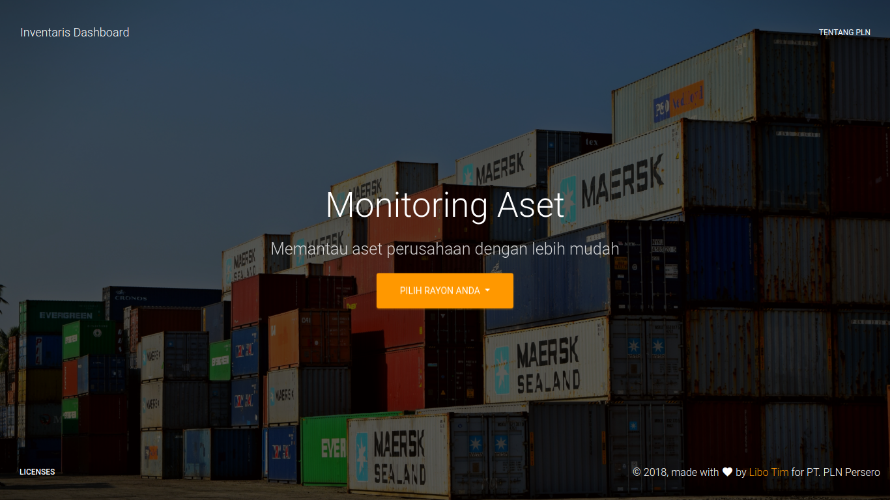

#Web App for monitoring assets

### How to use:
- clone or download this project
- place the project in the folder you want
- create database with a name warehouse-inventory
- import file named a warehouse-inventory.sql
- and good luck! :)
